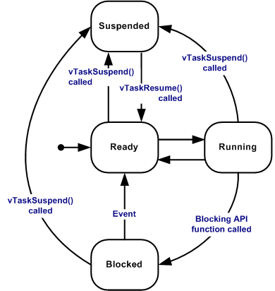

# Table of Contents

1. [Introduction to FreeRTOS](#introduction-to-freertos)
2. [Basic Concepts](#basic-concepts)
3. [Task Management](#task-management)
4. [Interrupt Management](#interrupt-management)
5. [Project Demo](#project-demo)
6. [Implementation Suggestions](#implementation-suggestions)
7. [Other Open-Source RTOS](#other-open-source-rtos)
8. [Conclusion](#conclusion)

# Introduction to FreeRTOS

FreeRTOS (Free Real-Time Operating System) is a popular, open-source real-time operating system kernel for embedded systems. It is designed to be small, simple, and easy to use while providing powerful features for real-time applications.

# Introduction to FreeRTOS

## Official Documentation
https://www.freertos.org/Documentation/00-Overview

## FreeRTOS Kernel
https://github.com/FreeRTOS/FreeRTOS-Kernel


# Introduction to FreeRTOS

## Key Features
- **Preemptive multitasking**: Tasks can be interrupted and resumed
- **Cooperative multitasking**: Tasks voluntarily yield control
- **Multiple scheduling algorithms**: Including priority-based
- **Inter-task communication**: Queues, semaphores, mutexes
- **Memory management**: Multiple heap allocation schemes
- **Portable**: Runs on many different microcontrollers

# Introduction to FreeRTOS - Application
## OV Watch
https://github.com/No-Chicken/OV-Watch

{width=70%}

{width=70%}

# Basic Concepts

## Tasks
Each runs independently and has its own stack, full API access, preemptive/cooperative scheduling, suitable for most applications.

## Co-routines
All share one stack (saves RAM), cooperative scheduling only, macro-based implementation, many usage restrictions, rarely used today.

# Basic Concepts
## Task States
- **Running**: Currently executing on the CPU
- **Ready**: Ready to run but waiting for CPU time
- **Blocked**: Waiting for an event (delay, semaphore, etc.)
- **Suspended**: Explicitly suspended and won't run until resumed

# Basic Concepts

{width=70%}


# Basic Concepts - Configuration

`FreeRTOSConfig.h` contains all configuration options for FreeRTOS

```c
// Enable preemptive scheduling
#define configUSE_PREEMPTION                    1
// Tick rate (Hz)
#define configTICK_RATE_HZ                      (1000)
// Stack size for idle task
#define configMINIMAL_STACK_SIZE                (64)
// Total heap size
#define configTOTAL_HEAP_SIZE                   (64 * 1024)
// Maximum number of priorities
#define configMAX_PRIORITIES                    (10)
// Enable mutexes
#define configUSE_MUTEXES                       1
```

# Basic Concepts - Scheduling Algorithms


## Fixed Priority Preemptive Scheduling
- Configuration:  `configUSE_PREEMPTION = 1`
- Higher priority tasks preempt lower priority tasks
- Same priority tasks share CPU time (Round Robin with time slice)

## Fixed Priority Cooperative Scheduling
- Configuration:  `configUSE_PREEMPTION = 0`
- Tasks voluntarily yield control using `taskYIELD()`
- No preemption: Tasks run until they explicitly give up CPU

## Time Slicing Scheduling
- Tasks with the same priority share CPU time equally
- Tasks switches between these tasks at each tick interrupt

# Task Management

## Task Priorities
- `configMAX_PRIORITIES` defines the maximum priority level in `FreeRTOSConfig.h`
- Higher numbers = higher priority


# Task Management - Task Functions

```c
void ATaskFunction( void *pvParameters );
```

# Task Management - Creation

```c
void vTaskFunction(void* pvParameters);

TaskHandle_t xTaskHandle;

int main(void) {
    ..
    xTaskCreate(                    // Create a task
        vTaskFunction,              // Task function
        "TaskName",                 // Task name
        configMINIMAL_STACK_SIZE,   // Stack size
        NULL,                       // Parameters passed to task
        1,                          // Priority (0 = lowest)
        &xTaskHandle                // Task handle
    );
    vTaskStartScheduler();          // Start the scheduler
    ...
}
```

# Task Management - Handling

## Define Task Deletion
```c
void vTaskDelete( TaskHandle_t pxTaskToDelete );
```

## Deleting a Task
```c
vTaskDelete(xTaskHandle);           // Delete the task

```

## Other Handler
```c
vTaskSuspend(xTaskHandle);          // Suspend the task

vTaskResume(xTaskHandle);           // Resume the task

vTaskPrioritySet(xTaskHandle, 2);   // Change priority
```

# Task Management
## Task Delays
```c
// Delay for a specific number of ticks
vTaskDelay(pdMS_TO_TICKS(1000));  // Delay for 1000ms

// Delay until a specific time
TickType_t xLastWakeTime = xTaskGetTickCount();
vTaskDelayUntil(&xLastWakeTime, pdMS_TO_TICKS(100));
```


# Interrupt Management

## Interrupt Safe API

FreeRTOS provides a set of "Interrupt Safe" API functions that can be safely called from within an Interrupt Service Routine (ISR). These functions are specifically designed to handle the restrictions and requirements of running in an interrupt context.

## Interrupt Safe API Implementation Files
- `queue.c` - Core interrupt-safe queue and semaphore functions
- `tasks.c` - Interrupt-safe task notification functions
- `timers.c` - Interrupt-safe timer functions
- `stream_buffer.c` - Interrupt-safe stream buffer functions

## Key Points:
- **Only use FreeRTOS API functions ending with `FromISR` in ISRs** (e.g., `xQueueSendFromISR`, `xSemaphoreGiveFromISR`).
- These are safe and fast for ISRs, often needing an extra parameter for context switching.


# FreeRTOS Kernel - Installation

Each real-time kernel port contains three common files and platform-specific files. Find the associated architecture in protable folder of microchip you use.

### Arduino
- https://docs.arduino.cc/libraries/freertos/

### ESP32
- https://docs.espressif.com/projects/esp-idf/en/stable/esp32/api-reference/system/freertos.html
- https://github.com/espressif/esp-idf/tree/v5.5.1/components/freertos

# FreeRTOS Kernel - Structure
{width=100%}

<!-- # FreeRTOS Kernel Structure

FreeRTOS Kernel/
|-- include/                  # Header files
|   |-- FreeRTOS.h            # Main FreeRTOS header
|   |-- task.h                # Task management
|   |-- queue.h               # Queue management
|   +-- ...                   # Other kernel headers
|-- portable/                 # Platform-specific implementations
|   |-- GCC/                  # GCC compiler ports
|   |   |-- POSIX/            # x86 Linux (e.g., for PC simulation)
|   |   |-- ARM_xxx/          # STM32 (Cortex-M3/M4/M7)
|   |   |-- AVR_xxx/          # Arduino (Samd/MegaAVR/AVR/Mbed)
|   |   +-- ...               # Other GCC-supported architectures
|   |-- MSVC-MingW/           # Microsoft Visual C++ ports
|   +-- ...                   # Other compiler ports
|-- list.c                    # Linked list implementation
|-- queue.c                   # Queue implementation
|-- tasks.c                   # Task scheduler
|-- timers.c                  # Software timers
|-- croutine.c                # Co-routines
|-- event_groups.c            # Event groups
+-- stream_buffer.c           # Stream buffers -->


# Project Demo - FreeRTOS EDF Scheduling

## FreeRTOS EDF Scheduling

FreeRTOS uses fixed-priority scheduling but lacks EDF support. EDF ensures better deadline adherence and resource utilization for real-time applications.

This project implements Earliest Deadline First (EDF) scheduling in FreeRTOS for IoT systems where task timing is critical and delays can cause failures or poor performance.real-time applications.

## See the project powerpoint

## https://github.com/monkeyark/558

# Project Demo - EDF scheduler implementation edf.c

```c
// Task structure for EDF
typedef struct _task
{
    int id;     // Task ID
    int at;      // Arrival time
    int et;      // Execution time
    int pd;      // Period
    int dd;      // Deadline
} task;

// Example task set
task taskSet[] = {
    {1, 0, 4, 12, 12},  // Task 1: 4ms exec, 12ms period, 12ms deadline
    {2, 0, 3, 9, 9},    // Task 2: 3ms exec, 9ms period, 9ms deadline
    {3, 0, 3, 6, 6},    // Task 3: 3ms exec, 6ms period, 6ms deadline
};
```

# Project Demo

## EDF Scheduler Implementation

```c
// Enable EDF scheduler in FreeRTOSConfig.h
#define configUSE_EDF_SCHEDULER    1

// Create EDF task
xTaskCreate_EDF(
    vTaskFunction,      // Task function
    "EDFTask",          // Task name
    configMINIMAL_STACK_SIZE,
    NULL,               // Parameters
    1,                  // Priority (used for tie-breaking)
    NULL,               // Task handle
    TASK_PERIOD,        // Period
    TASK_DEADLINE       // Deadline
);
```


# Project Ideas

## 1. Implementation of Rate Monotonic Scheduling / Priority Inversion / ...

## 2. IoT Data Logger
Build a data collection device using an ESP32 that reads multiple sensors, stores data locally, and transmits to cloud services via WiFi. FreeRTOS can manage tasks for periodic sensor sampling, data storage, and network communication, ensuring reliable data logging and efficient use of system resources.


# Implementation Suggestions

## Priority Assignment
- Use as few priority levels as possible
- Reserve highest priority for critical tasks
- Avoid priority inversion scenarios

## Task Design
- Keep tasks simple and focused
- Use appropriate delays to prevent CPU hogging
- Design for preemption

## Memory Management
- Choose appropriate heap allocation scheme
- heap_1 - the very simplest, does not permit memory to be freed.
- heap_2 - permits memory to be freed, but does not coalescence adjacent free blocks.
- heap_3 - simply wraps the standard malloc() and free() for thread safety.
- heap_4 - coalescences adjacent free blocks to avoid fragmentation. Includes absolute address placement option.
- heap_5 - as per heap_4, with the ability to span the heap across multiple non-adjacent memory areas.

# Other open-source RTOS

## Zephyr

- https://www.zephyrproject.org/
- https://github.com/zephyrproject-rtos

## Apache NuttX

- https://nuttx.apache.org/
- https://github.com/apache/nuttx


# Reference
## FreeRTOS Official Documentation
[1] FreeRTOS, "FreeRTOS Documentation: Overview," [Online]. Available: https://www.freertos.org/Documentation/00-Overview. [Accessed: Jun. 2024].

## FreeRTOS Kernel
[2] FreeRTOS, "FreeRTOS Kernel," GitHub repository, https://github.com/FreeRTOS/FreeRTOS-Kernel [Accessed: Jun. 2024].


## FreeRTOS on STM32
[3] "FreeRTOS Tutorial Video Series," YouTube, https://www.youtube.com/watch?v=QGVAayFI5ZQ&list=PLnMKNibPkDnFeFV4eBfDQ9e5IrGL_dx1Q [Accessed: Jun. 2024].

# Questions

## Questions?

